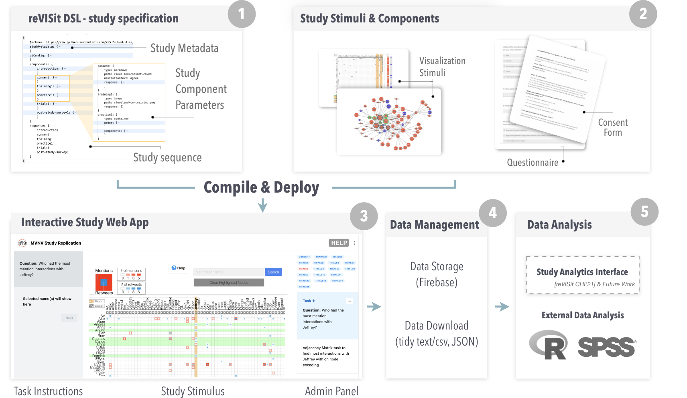

# Introduction

reVISit lets you create interactive, web-based study setups using a JSON domain-specific language (DSL), called reVISit.spec, and a set of stimuli specified in the DSL. Once you have created a spec and the stimuli, you can build your study and deploy it to the web. You can use stimuli that are images, (interactive) html pages, or react components. 

The overall process is shown in the following figure: 

In the tutorials section, we'll walk you through a simple example to create your first study with reVISit! 

## The ReVISit DSL

The ReVISit framework uses a declarative DSL (Domain Specific Language) for specifying visualization experiments. The configuration file uses JSON format which compiles into the ReVISit platform. In the following tutorials, you will see how we configure a visualization experiment using the ReVISit DSL.

## Environment Setup

The ReVISit frameworks provides an environment that allows researchers to build web-based visualization user studies by cloning/forking a github repository. Users can then customize the properties of a configuration file which allows for the specification of desired study components (e.g. consent, training, practice, trials, stimuli and survey).