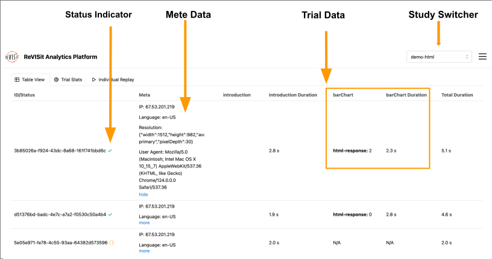

# Tableview

The table view display the user data of a study in a table format. It is designed to allow researchers to inspect each record in detail.

Each row represents a record of a participant in the study. It includes the participant's ID, status indicator, metadata(IP address, screen resolution, user agent), responses to questions in each trial, and the time they spent.
For each trial, all question IDs and corresponding answers are displayed in the same cell. The time the participant spent on the trial is shown in a separate cell. 

For instance, in the image above, the 'barChart' trial has one question with the ID 'html-response', and the first participant gave the answer '2' in 2.3 seconds.
Right beside the participant's ID, the green checkmark icon indicates that this participant has completed the study, while the yellow circular icon indicates that this participant is still in progress.

You can quickly navigate to different studies by using the dropdown menu in the top right corner. 

:::info
Trial Stats and Individual Replay features are coming soon.
:::