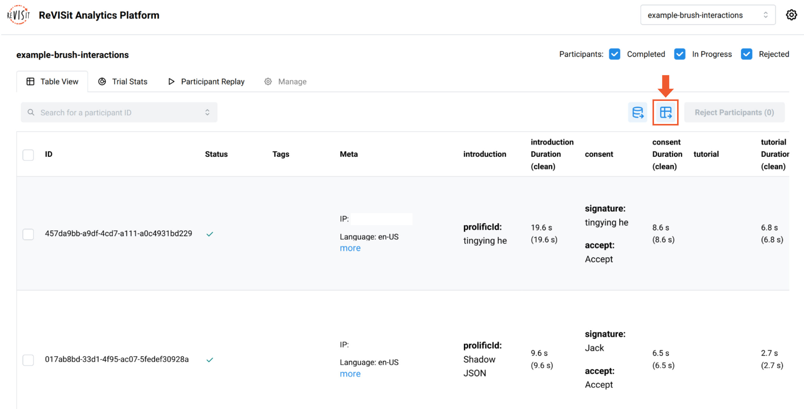
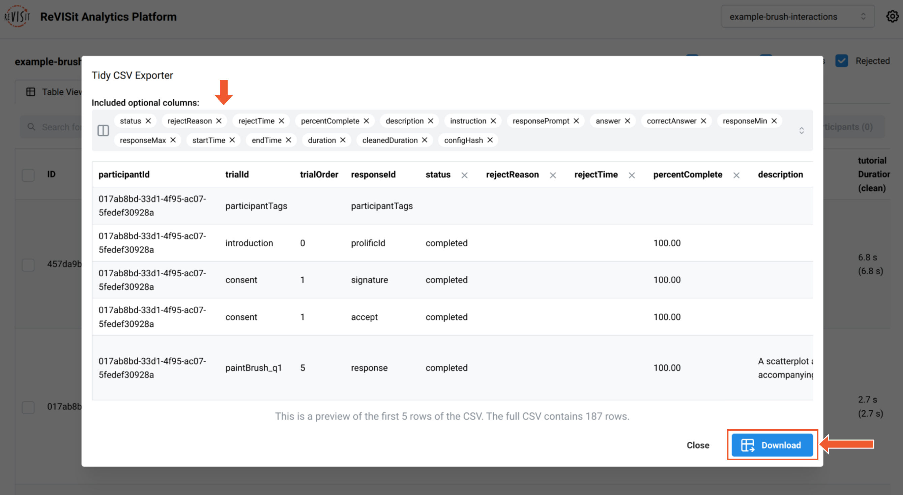

# Data Export and Basic Analysis

reVISit allows you to export in [Tidy](https://cran.r-project.org/web/packages/tidyr/vignettes/tidy-data.html) format for analysis in Python notebooks or R.

## Steps to Download Data

1. Navigate to the **Analysis** platform for the current study.

2. Open the Table View, then click on the **Download all participants' data as a tidy CSV** button. Here's a [direct link for the example below](https://revisit.dev/study/analysis/stats/example-brush-interactions/table).



3. The **CSV Explorer** will open, where you can select the columns to export. A preview of the first five rows of the output CSV will be displayed.

4. Once ready, click the **Download** button at the bottom right.




After downloading the Tidy data, you can import it into  your favorite analysis platform for further analysis. Below is an example of how to work with exported data from the [Interactive Selections in Scatterplots](https://revisit.dev/study/example-brush-interactions) study in R.


## Example Workflow in R

### 1. Install Necessary Packages

```r
list.of.packages <- c("ggplot2", "Hmisc")
new.packages <- list.of.packages[!(list.of.packages %in% installed.packages()[,"Package"])]
if(length(new.packages)) install.packages(new.packages)

library(ggplot2)
```

### 2. Read and Preview the Data

```r
df <- read.csv("data/example-brush-interactions_all_tidy.csv")
head(df)
```

|   | participantId                        | trialId       | trialOrder | responseId   |
|---|--------------------------------------|---------------|------------|--------------|
| 1 | 017ab8bd-33d1-4f95-ac07-5fedef30928a | introduction  | 0          | prolificId   |
| 2 | 017ab8bd-33d1-4f95-ac07-5fedef30928a | consent       | 1          | signature    |
| 3 | 017ab8bd-33d1-4f95-ac07-5fedef30928a | consent       | 1          | accept       |
| 4 | 017ab8bd-33d1-4f95-ac07-5fedef30928a | paintBrush_q1 | 5          | response     |
| 5 | 017ab8bd-33d1-4f95-ac07-5fedef30928a | paintBrush_q2 | 6          | max-response |


### 3. Filter Data for Task `q2`


```r
q2 <- subset(df, grepl("_q2", trialId) & status == "completed")
q2$isCorrect <- ifelse(q2$answer == q2$correctAnswer, 1, 0)
q2 <- subset(df, grepl("_q2", trialId) & status == "completed")
q2$isCorrect <- ifelse(q2$answer == q2$correctAnswer, 1, 0)
```


### 4. Create a Violin Plot

The plot displays correct answers on the right and incorrect answers on the left.

```r
ggplot(q2, aes(x = isCorrect, y = trialId)) +
  geom_violin(aes(fill = trialId), color = "#888", alpha = 0.7) +
  stat_summary(fun.data = "mean_cl_boot", colour = "#333", size = 0.5, alpha=0.5) +
  theme_minimal() +
  theme(legend.position = "none") +
  labs(
    title = "Violin Plot for q2 (Finding most/least value)",
  )
```


We find accuracy using paint brush technique is much less than that of the others.


### 5. Export the generated plot.

```r
ggsave("plot.pdf", width = 5, height = 2, units = "in")
```


