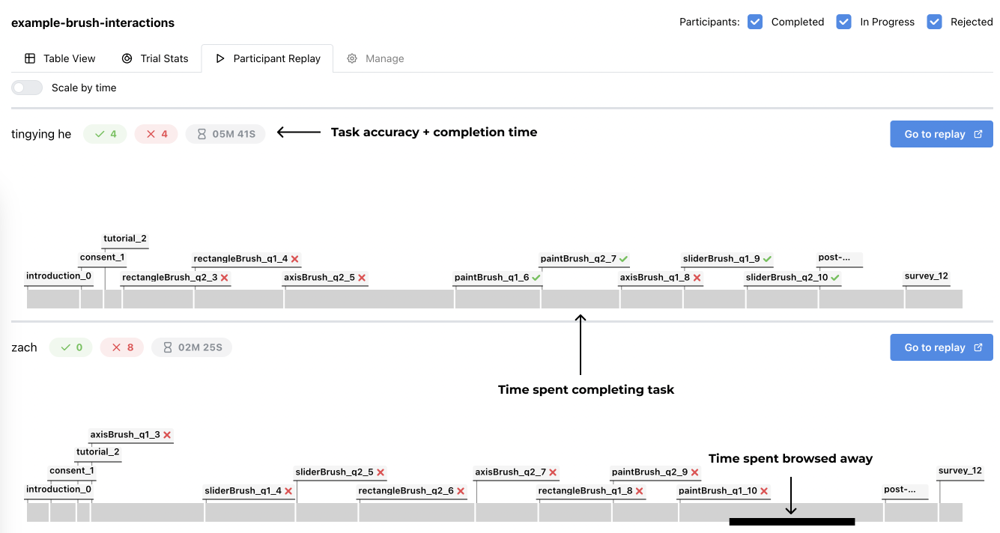
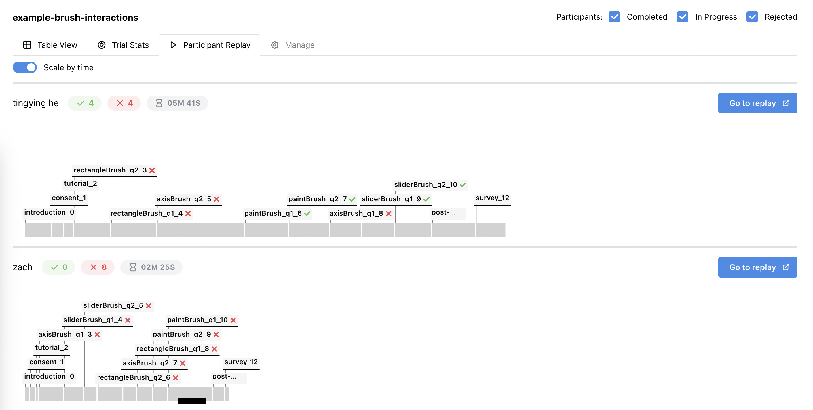
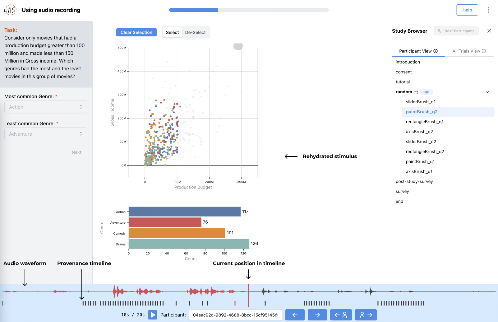

# Participant Replay

The participant replay tab can be used for an overview of each participants study. 

Information on task accuracy and completion times can be found for each participant, as well as a timeline showing how long each participant took for each task. There is also an option at the top of the page to use the same time scale for each participant, in order to compare completion times. 

To view the provenance or audio replay for a single participant, click on the `Go to replay` button or click on a task on the timeline. 

Task replay is intended to be used with provenance, audio recording, or both. Audio and provenance are synced, and the provenance data is used to rehydrate the task stimulus, showing researchers what participants saw while taking the study. 