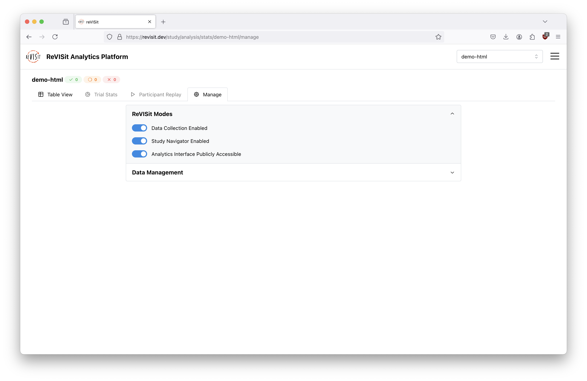

# The Lifecycle of a reVISit Study

import StructuredLinks from '@site/src/components/StructuredLinks/StructuredLinks.tsx';

<StructuredLinks
referenceLinks={[
{name: "Snapshots", url: "../../analysis/data-management/#snapshots"}
]}
/>

A reVISit study will go through multiple stages over its lifetime. It'll first start as a local study that is iteratively refined until the study is fully built, it will then be deployed and tested, it will be send out to participants for data to be collected, and finally the study will be disseminated to reviewers.

## Revisit Modes

To assist study designers with each stage of this process, we expose 3 application state switches:

1. Data collection enabled - This enables/disables data collection which is useful when making modifications to the study when you don't want to add data to the database. This also disables sequence assignments, which means viewing the study will not affect your latin square balance.
2. Study navigator enabled - This enables the study browser in the study interface. This is great for moving around your study during development, and great for reviewers that might want to inspect the stimuli you gave to participants.
3. Analytics interface publicly accessible - This makes the study visible to un-authenticated users in the analytics platform. This is great for sharing your results with reviewers and the wider public. We suggest that when this mode is turned on, you also disable data collection so that your data is not tainted by people reviewing your study.

## Local Development

In local development, it's likely that you want to collect sample data, try multiple sequences, navigate through the study, and see the collected data. To this end, you will likely want to:

- Enable data collection
- Enable the study navigator
- Make the analytics interface publicly accessible

## Testing a Production Deployment

Just as in local development, when testing your study on the production deployment, you should:

- Enable data collection
- Enable the study navigator
- Make the analytics interface publicly accessible

## Collecting Participant Data

When you start collecting participant data, you will want to:

- Clear out the testing data from your database using the [snapshots](../analysis/data-management.md) interface
- Enable data collection
- Disable the study navigator
- Make the analytics interface not publicly accessible

## Disseminating to Reviewers

When disseminating your study to reviewers and the wider public, you should:

- Make a snapshot of your data using the [snapshots](../analysis/data-management.md) interface. Snapshots create a copy of your data to protect against any issues, but allows the wider public to see your collected data.
- Disable data collection
- Enable the study navigator
- Make the analytics interface publicly accessible

If your are submitting to a venue that requires anonymization, such as ACM SIGCHI, consider creating a second deployment. If your primary deployment is on GitHub, consider adding a secondary one on [netlify](/docs/data-and-deployment/deploying-to-static-website/#deploying-using-netlify).
