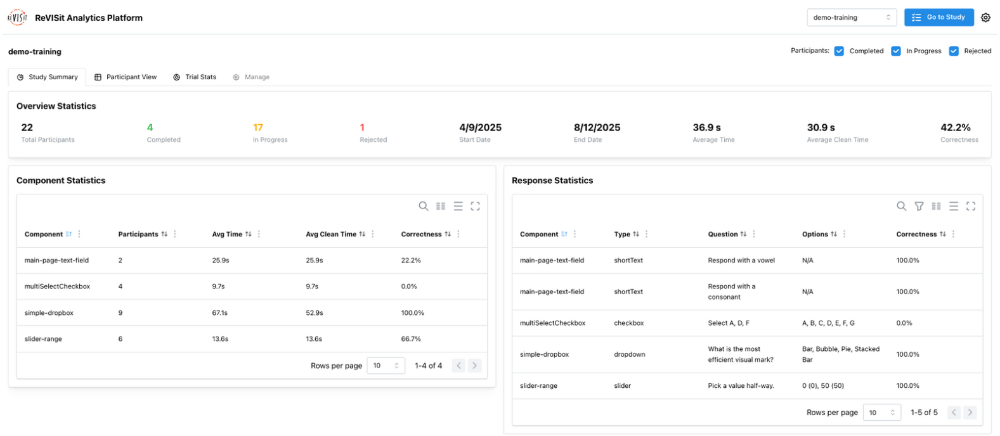
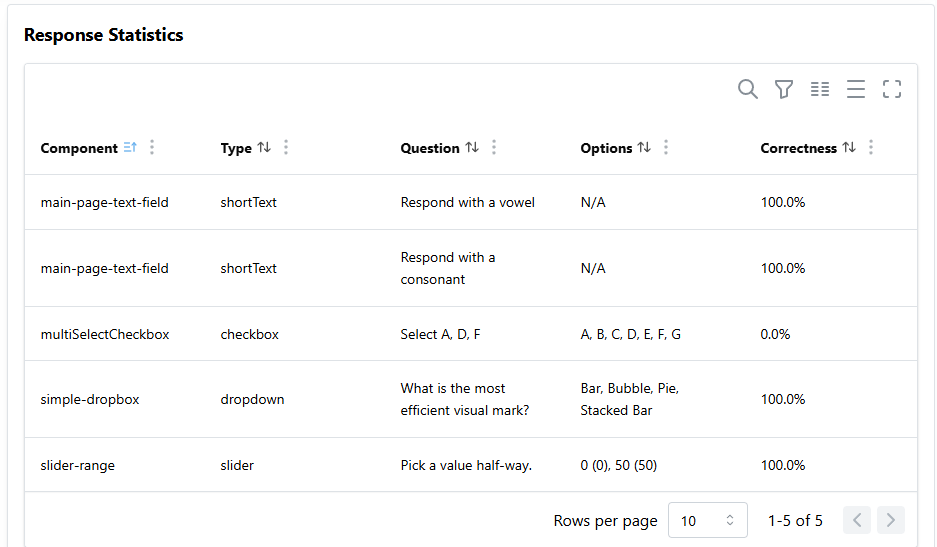

# Study Summary

The study summary gives users a quick overview of their study at a glance. It provides a comprehensive overview of their study data in a single, easy-to-understand dashboard.

The summary is organized into three main sections: Overview Statistics, Component Statistics, and Response Statistics. At the top, participant filters allow you to filter the analysis by including or excluding completed, in-progress, or rejected participants.

## Overview Statistics

This section shows key numbers about the study.

- Total Participants – total number of people in the study  
- Completed / In Progress / Rejected – counts of participants by status (green = completed, yellow = in progress, red = rejected)  
- Start Date / End Date – when the first participant started and the last one finished the study
- Average Time – average time participants spent on the study  
- Average Clean Time – average time spent without browsing away from the study
- Correctness – overall percentage of correct answers  

## Component Statistics

This section shows each part of the study in a table you can sort, filter, and search.

- Component – name of the study part  
- Participants – number of people who did this part  
- Avg Time – average time spent  
- Avg Clean Time – average time without browsing away  
- Correctness – percentage of correct answers (shows N/A if the component has no correct answer)

## Response Statistics

This section provides details for each question, with each row representing a single question.

- Component – part of the study with this question  
- Type – kind of response (see [BaseReponse](../../typedoc/interfaces/BaseResponse) for all response types)
- Question – question prompt
- Options – answer options given to the participants
- Correctness – percentage of correct answers  
