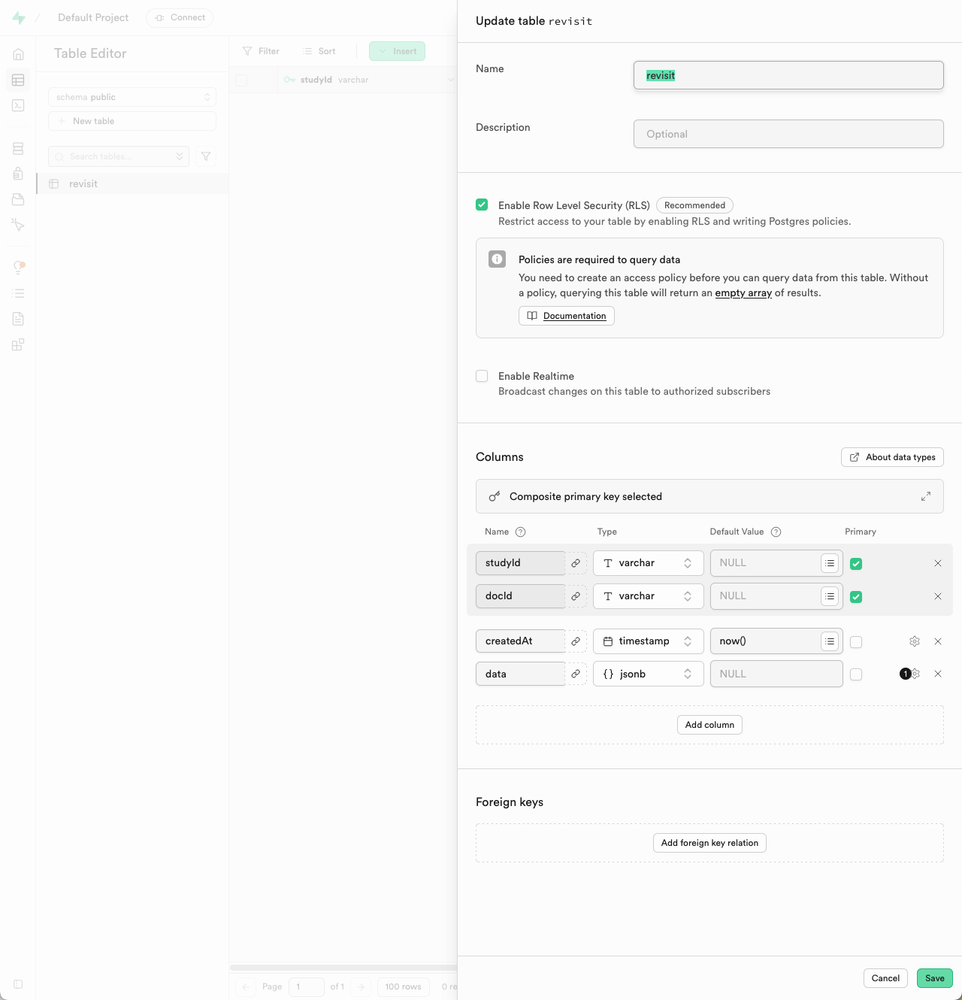
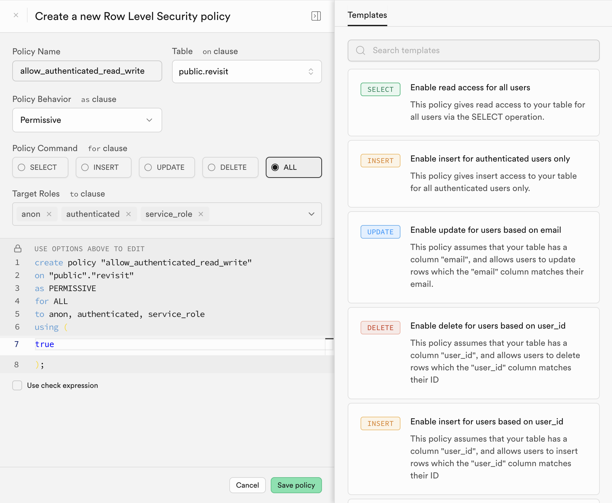
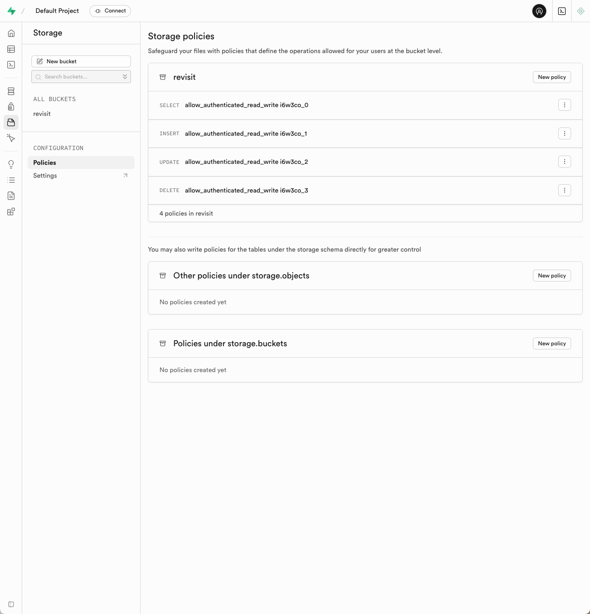

# Configuring Supabase

import StructuredLinks from '@site/src/components/StructuredLinks/StructuredLinks.tsx';

<StructuredLinks
    referenceLinks={[
        {name: "Supabase", url: "https://supabase.com/"},
        {name: "Supabase Documentation", url: "https://supabase.com/docs/guides"},
        {name: "Deploying to GitHub", url: "../deploying-to-static-website"}
    ]}
/>

<a href="https://supabase.com/" target="_blank" >Supabase</a> is an open-source alternative to Firebase that provides a real-time database and storage solution. It is built on top of PostgreSQL, which allows for more complex queries and data structures. Supabase is particularly useful for researchers who need to comply with strict data privacy regulations, as it can be self-hosted.

This guide will be focused on setting up a self hosted Supabase instance for use with reVISit. If you would like to use a hosted solution, we suggest that you use the firebase implementation instead. However, if you would like to use Supabase, as a hosted solution, you can follow the instructions on their website to stand up a hosted instance.
### Pre-requisites

Before you begin, ensure you have the following:
- A Linux server or cloud VM where you can install Supabase (EC2, DigitalOcean Droplet, etc.; Ubuntu LTS is recommended)
- Basic knowledge of Docker and Docker Compose
- SSH access to the remote server
- Access to your cloud firewall controls (EC2 Security Groups, DigitalOcean Cloud Firewall, or `ufw`)
- A domain name is strongly recommended if you plan to enable HTTPS/SSL

### Setting Up Supabase

Once your server or VM is running, follow these steps:

1. **SSH into the remote server**: From your local machine, connect to your server:

   ```bash
   ssh <user>@<server-ip>
   ```

   All remaining setup commands in this section should be run on the remote server.

2. **Install Docker and Docker Compose**: If you don't have Docker installed, follow the [official Docker installation guide](https://docs.docker.com/get-docker/). Then install Docker Compose using the [Docker Compose installation guide](https://docs.docker.com/compose/install/).

3. **Clone the reVISit repository on the server**: Navigate to the directory where you want to host Supabase and clone the reVISit repository. If it already exists on the server, pull the latest changes.

4. **Navigate to the Supabase directory**: Inside the reVISit repository, navigate to the `supabase` directory.

5. **Update the `.env` file**: We provide a `.env` file that must be updated with your own credentials and secrets. Leaving defaults in place creates an insecure deployment. Follow the instructions on the [Supabase self-hosting documentation](https://supabase.com/docs/guides/self-hosting/docker#securing-your-services) to secure your `.env` file.

6. **Start Supabase**: Run the following command to start Supabase using Docker Compose:

   ```bash
   docker-compose up -d
   ```

   This will pull the docker images and start the Supabase services in detached mode.

7. **Configure remote network access (important)**: For a remote server deployment, explicitly configure inbound firewall rules:

   - **EC2 Security Group**: Allow `22` (SSH) from your admin IP; allow `80` and `443` from the internet if using a reverse proxy; only allow `8000` from trusted admin IPs if you must expose it directly.
   - **DigitalOcean Cloud Firewall / `ufw`**: Same pattern as above. Keep dashboard/admin ports restricted whenever possible.
   - Do **not** open database/internal ports publicly unless you have a specific, secured need.

8. **Access the Supabase Dashboard**:
   - Direct access (less secure): `http://<server-ip>:8000`
   - Recommended while administering remotely: use an SSH tunnel from your local machine:

     ```bash
     ssh -L 8000:localhost:8000 <user>@<server-ip>
     ```

     Then open `http://localhost:8000` locally.

   Log in using the credentials you set in the Supabase `.env` file.

:::info
For long-term deployments, prefer exposing Supabase through HTTPS on `443` via a reverse proxy and keep `8000` private.
:::

9. **Create a table for reVISit data**: You will need to create a table for storing user data. In the Supabase dashboard you should see that you're in the default project. From here click on "Table Editor" (the second icon) and then "New table" to create a new table.  The table should be called `revisit` and should have the following columns

    | Column Name | Data Type | Constraints                |
    |-------------|-----------|----------------------------|
    | createdAt   | Timestamp | Default: `now()`           |
    | studyId     | Varchar   | Primary Key                |
    | docId       | Varchar   | Primary Key                |
    | data        | JSONB     | Nullable                   |

    **Notes:**
    - Set both `studyId` and `docId` as composite primary keys.
    - The `createdAt` column should automatically use the current timestamp.
    - The `data` column can store any JSON object and can be left empty.

    

    Save the table. The new table requires a policy to allow authenticated users to read and write to the table. You can do this by clicking on "Add RLS Policy" in the table editor and adding a new policy to the revisit table.

    The policy should be called `allow_authenticated_read_write`, be on public.revisit, be Permissive, and allow all operations. Select "anon", "authenticated", and "service_role" as the roles that can access this policy. In the "using" block add `true`. At the bottom, uncheck "Use check expression". Now click "Save Policy".

    

10. **Create a storage bucket**: In the Supabase dashboard, navigate to the "Storage" section (6th icon) and create a new bucket called `revisit`. This bucket will be used to store participant data, audio, configs, etc. Ensure that the bucket is not public, as we want to restrict access to the data to users of your reVISit deployment.

    

  Since your bucket is not public, you will need to set up a policy to allow authenticated users to read and write to the bucket. You can do this by navigating to the "Policies" tab in the bucket settings and adding a new policy to the revisit bucket.

  Name the policy `allow_authenticated_read_write` and allow select, insert, update, and delete operations. Select "anon", "authenticated", and "service_role" as the roles that can access this policy and click next. The top of the 4 policies should look like this:

   ```sql
   CREATE POLICY "allow_authenticated_read_write i6w3co_0"
   ON storage.objects
   FOR SELECT TO anon, authenticated, service_role
   USING (bucket_id = 'revisit');
   ```

   Click save policy.

   

11. **Update your `.env` file in your deployed reVISit application**: In the root of your reVISit application, update the `.env` file with the following variables:

   ```env
   VITE_STORAGE_ENGINE="supabase"
   VITE_SUPABASE_URL="https://<your-supabase-base-url>"
   VITE_SUPABASE_ANON_KEY="<your-anon-key>"
   ```
  Replace `<your-supabase-base-url>` with the public URL used by clients to reach Supabase (for example, `supabase.your-domain.com` or your server IP/port during testing), and `<your-anon-key>` with the anon key found in the Supabase `.env` file.

12. **Redeploy your reVISit application**: After updating the `.env` file, redeploy your reVISit application to ensure that it connects to the Supabase instance correctly.

After following these steps, your reVISit application should be connected to your Supabase instance, and you can start collecting data from participants.

### HTTPS/SSL Configuration

To ensure secure communication between your reVISit application and the Supabase instance, it is recommended to set up HTTPS/SSL. You can use a reverse proxy like Nginx or Caddy to handle SSL termination. It's required that your server or VM has a Fully Qualified Domain Name (FQDN) and a valid SSL certificate. With those in place, you can configure your reverse proxy to redirect HTTP traffic to HTTPS and handle SSL termination.

For example, if you are using Nginx, you can set up a server block like this:

```nginx
server {
    listen 80;
    server_name your-domain.com;
    return 301 https://$host$request_uri;
}
server {
    listen 443 ssl;
    server_name your-domain.com;

    ssl_certificate /path/to/your/certificate.crt;
    ssl_certificate_key /path/to/your/private.key;

    location / {
        proxy_pass http://localhost:8000; # Supabase endpoint exposed by Docker Compose
        proxy_set_header Host $host;
        proxy_set_header X-Real-IP $remote_addr;
        proxy_set_header X-Forwarded-For $proxy_add_x_forwarded_for;
        proxy_set_header X-Forwarded-Proto $scheme;
    }
}
``` 
Make sure to replace `your-domain.com` with your actual domain name and provide the correct paths to your SSL certificate and private key.

Once the reverse proxy is set up, you can access your Supabase instance securely over HTTPS. Update `VITE_SUPABASE_URL` in your reVISit `.env` file to use `https://` and drop the port if you are using default `443` (as shown in the example above).
