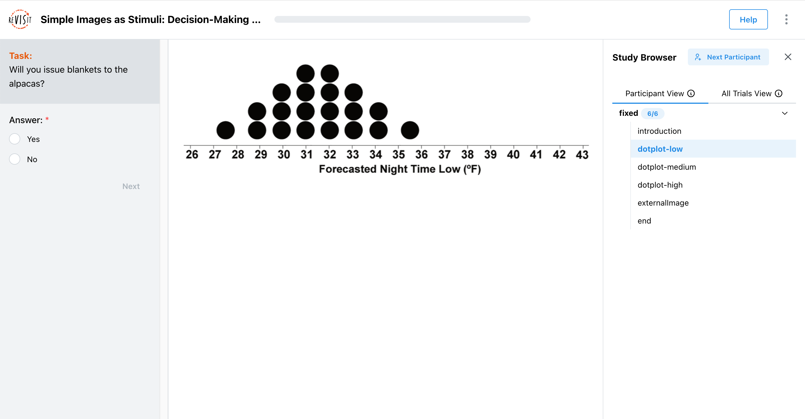
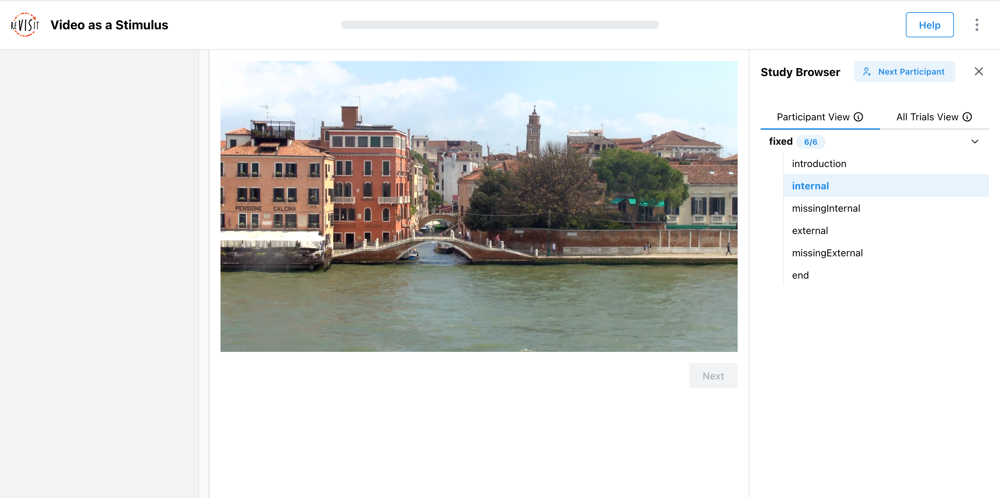
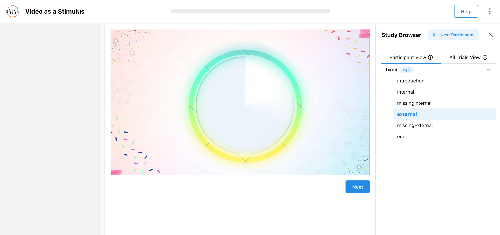

# Designing Image/Video Stimuli


Image and video stimuli are essential for most studies. They can be used to present visual information, such as charts, images, or videos, to participants. This tutorial provides an overview of how to use image and video stimuli in your study.

## Image Stimuli

Image stimuli are components of type `image`. Here is a simple example with an image element: 

```js
"components": {
  "dotplot-low": {
    "type": "image",
    "path": "demo-image/assets/uncertainty-1.png",
    "instruction": "Will you issue blankets to the alpacas?",
    "style": {
      "width": "800px"
    },
    "nextButtonLocation": "sidebar",
    "response": [
      {
        "id": "demo-image/assets-response",
        "prompt": "Answer:",
        "location": "sidebar",
        "type": "radio",
        "options": [
          "Yes",
          "No"
        ]
      }
    ],
  },
}
```

This renders like that:



In this example, the image is rendered in the main window with a response in the sidebar. The image is given an optional parameter `style` to specify the width of the image. This object support arbitrary CSS properties.

## Video Stimuli

Video stimuli are components of type `video`. Here is a simple example with a video element: 

```js
"components": {
  "internal": {
    "type": "video",
    "path": "demo-video/assets/venice.mp4",
    "forceCompletion": true,
    "response": []
  },
}
```

This renders as so:



In this example, the video is rendered in the main window. The video is given an optional parameter `forceCompletion` to specify whether the video must be watched in full before the participant can proceed. This is useful for ensuring that participants watch the entire video before answering questions.

## Youtube Videos

You can also embed Youtube videos in your study, using the same syntax. Here is an example with a Youtube video element: 

```js
"components": {
  "external": {
    "type": "video",
    "path": "https://www.youtube.com/watch?v=icPHcK_cCF4",
    "forceCompletion": false,
    "withTimeline": true,
    "response": []
  },
}
```

This renders as so:



In this example, the video is rendered in the main window. The video is given an optional parameter `forceCompletion` to specify whether the video must be watched in full before the participant can proceed. In this case, the video does not need to be watched in full, so the `forceCompletion` parameter is set to `false`. The `withTimeline` parameter adds a timeline to the video, allowing participants to skip/scrub to specific parts of the video.


import StructuredLinks from '@site/src/components/StructuredLinks/StructuredLinks.tsx';

<StructuredLinks
    demoLinks={[
        {name: "Image Demo", url: "https://revisit.dev/study/demo-image/"},
        {name: "Video Demo", url: "https://revisit.dev/study/demo-video/"}
    ]}
    codeLinks={[
        {name: "Image Code", url: "https://github.com/revisit-studies/study/tree/main/public/demo-image"},
        {name: "Video Code", url: "https://github.com/revisit-studies/study/tree/main/public/demo-video"}
    ]}
    referenceLinks={[
        {name: "Image Component", url: "../../typedoc/interfaces/ImageComponent/"},
        {name: "Video Component", url: "../../typedoc/interfaces/VideoComponent/"}
    ]}
/>