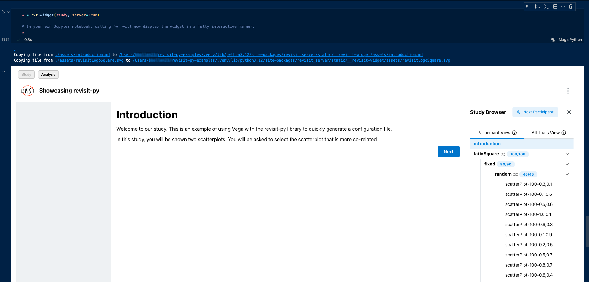

# ReVISitPy Python Package


The reVISitPy python package is a pip package that aids in the construction of configuration files. Just like in the study configuration file, you can create components, responses, study metadata, UI config, and complex sequences. Then, you can combine these all together in a single study configuration file. Here is an example of creating a simple response and attaching it to a single component.

```python
response_one = rvt.response(
    id='response_one',
    type='shortText',
    prompt='Original Prompt:'
)

component_one = rvt.component(
    component_name__='component_one',
    type='questionnaire',
    response=[test_response]
)

print(component_one)

'''
Expected Output:
{
    "response": [
        {
            "id": "test_response",
            "prompt": "Original Prompt:",
            "type": "shortText"
        }
    ],
    "type": "questionnaire"
}
'''
```

Each of the classes that we exposed can be printed to show the JSON output. 

## Closed Feedback Loop

We wanted to create a package which not only makes creating long, complex configuration files easier, but also provide feedback for your designs faster. ReVISitPy exposes a `widget` component that allows you to immediately visualize a configuration file directly in a Jupyter notebook.



When using the widget, you can immediately interact with the study in the Jupyter notebook and see how each of your components and responses will function. Additionally, you can see how the data will be outputted in the Analysis tab and even export your testing data back to the Jupyter notebook.

:::info
Note that a Jupyter environment is not necessary to take advantage of reVISitPy. Jupyter enhances the experience by providing this widget functionality, but configuration files can still be created and saved using reVISitPy with a standard python environment.
:::

<!-- Maybe a video here?? Or Just a screenshot?? Probably need to wait to push the new packages.-->


## Advanced Sequence Creation

When using the reVISitPy python package, not only do you have all the flexibility of using a full programming language, we have also built several different features to help create complex study designs. Generated data in a separate CSV file? Pass the data in using reVISitPy's `from_data` method in order to create components based on the data. Need to permute over multiple different factors? Use the `Sequence` class's built-in `permute` function to generate components based on these factors while simultaneously permuting over possible combinations of them.


## Usage

If you're ready to get started using the reVISitPy in your own python environment, check out the [installation page](./installation.md). If you'd like to try out the package as quick as possible, we instead suggest using the [reVISitPy examples repository](https://github.com/revisit-studies/revisit-py-examples). This repository uses a jupyter notebook to walk you through each example. Start by cloning the repository:


```bash
git clone git@github.com:revisit-studies/revisit-py-examples.git
```

Once you have cloned the repository, we recommend installing the python package manager [uv](https://docs.astral.sh/uv/). We use `uv` for a myriad of reasons, but most importantly because it will manage your virtual environment for you which ensures that you'll be able to use the repository with very little set up.

After you've installed `uv`, navigate to the examples repository you just cloned and call the following:

```bash
uv install
```

This will install all the necessary dependencies for the examples, including reVISitPy (`revisitpy`) and its support package (`revisitpy-server`). 

:::note
When choosing the Jupyter kernel to use, you should use the one that corresponds to the virtual environment in the `revisit-py-examples` repository. This, by default, will be initialized in the `.venv` directory after running `uv install`.
:::

Each of the examples in the `revisit-py-examples` repository are also shown [here](./examples/index.md) in markdown format.


import StructuredLinks from '@site/src/components/StructuredLinks/StructuredLinks.tsx';

<StructuredLinks
    codeLinks={[
        {name: "reVISitPy Examples", url: "https://github.com/revisit-studies/revisitpy-examples"}
    ]}
    referenceLinks={[
        {name: "reVISitPy Installation", url: "./installation"},
        {name: "reVISitPy Examples", url: "./examples"}
    ]}
/>