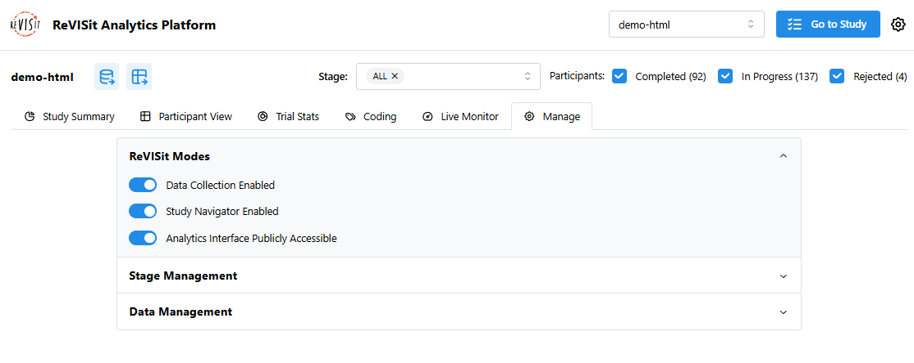

# ReVISit Modes

Each of the reVISit studies has various modes which enable different features. These can be managed in the "Manage" tab of a particular study in our analysis interface. You can also view the current mode status from the study card.

Here we give a brief introduction to these modes. Check out our [Analysis Platform Documentation](../../analysis) for more information on managing your data and studies. Additionally, you can find our [best practices](../../data-and-deployment/lifecycle-of-revisit) for using these modes to manage the lifecycle of your reVISit study.

## Data Collection

With Data Collection enabled, all data that is captured by participants will be stored either locally or in your cloud database (dependent on your currently specified storage engine). You can check out our [data management documentation](../../analysis/data-management) to learn how to manage participants, create backup datasets, and more.

Disabling data collection on a particular study will cause the user to see a `DEMO MODE` icon in the upper right hand corner. This is to alert users that their data is not currently being collected.

## Study Navigator

When the study navigator is enabled, any user will be able to access the study's "study browser". This allows users to move between any two components in the study freely. This is especially useful when you are disseminating your study after all data collection has completed and you'd like to share your study with the broader public.

## Analytics Interface Publicly Accessible

The analytics interface provides administrators with a way to view, download, and manage study data. When enabling this mode, all the data for this particular study will be viewable by the broader public. This means that anybody can view the participants, see the answers given, and download all the data.